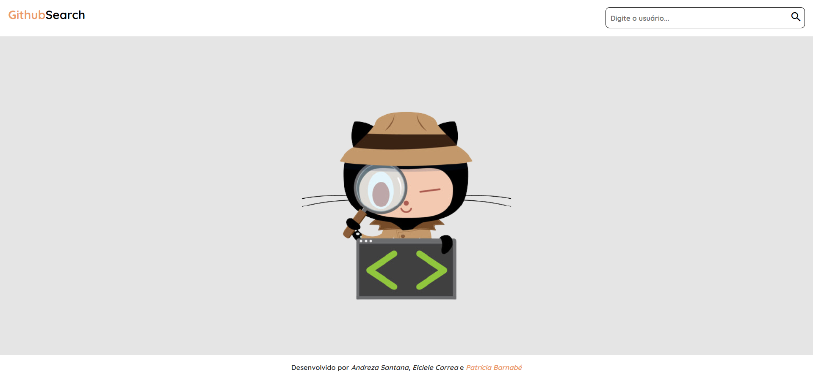
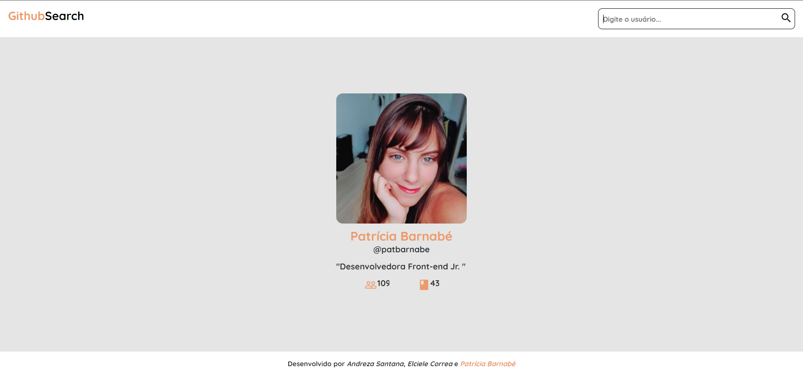
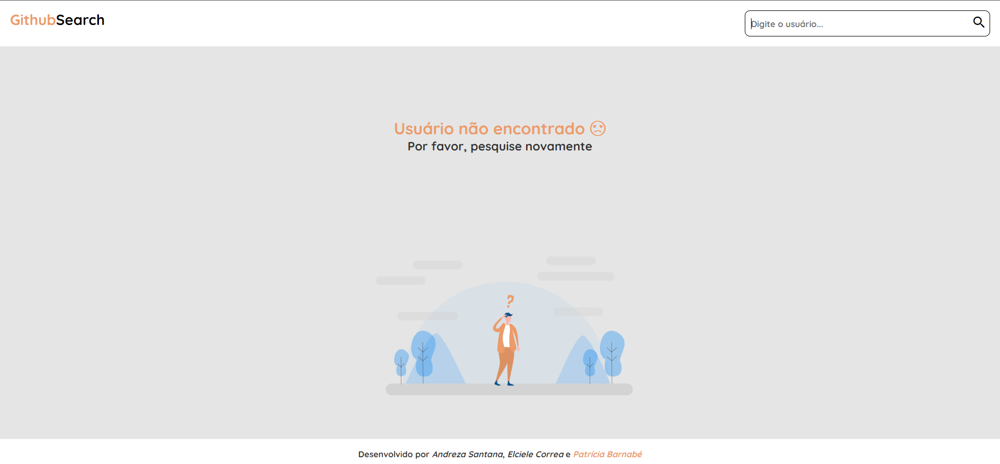

<h1 align="center">Reprograma 💜 Todas Em Tech - Projeto Github Search</h1>

10ª Turma | Front-end | maio 2021 

## Índice

1. [Projeto](#-projeto)
2. [Tecnologias Utilizadas](#robot-tecnologias-utilizadas)
3. [Resultado](#%EF%B8%8F-resultado)
4. [Sobre a Desenvolvedora](#-sobre-a-desenvolvedora)

---

## 📚 Projeto
Neste projeto, deverá ser desenvolvida uma aplicação de pesquisa que usará a [API do GitHub](https://docs.github.com/pt/rest) para recuperar informações do usuário quando um nome de usuário válido é inserido. Deverá ser exibido o avatar, o nome de usuário, a contagem de seguidores e a contagem de repositórios.

- [x] Criar o layout seguindo o [Figma](https://www.figma.com/file/UjuUSqwVpb7OtbWysQZffj/github-search?node-id=0%3A1) disponibilizado.
- [x] O Input recebe o username de um usuário. Quando clicar no botão de pesquisa, caso o usuário exista dentro da base de dados da API, a aplicação deve mostrar os dados desta forma: 
   - Exibir o avatar.
   - Nome do usuário.
   - Username
   - Bio
   - Total de seguidores
   - Total de repositórios
- [x] Validar campo de texto para não entrar texto vazio
- [x] Limpar campo de texto depois que inserir o nome de usuário
- [x] O usuário deve ser redirecionado para uma página de usuário não encontrado caso não exista perfil com aquele nome de usuário

---

## :robot: Tecnologias Utilizadas

| Ferramenta | Descrição |
| --- | --- |
| `HTML 5` | Linguagem de marcação |
| `CSS3` | Linguagem de estilização |
| `JavaScript` |  Linguagem de programação interpretada estruturada|
| `Git e GitHub` | Sistemas de controle de versões distribuídos|

---

## ✔️ Resultado

    
    
    
    

---

## 👩‍💻 Sobre a Desenvolvedora
### Patrícia Barnabé

- [LinkedIn](https://www.linkedin.com/in/patriciabarnabe)
- E-mail: patbarnabe5@gmail.com
